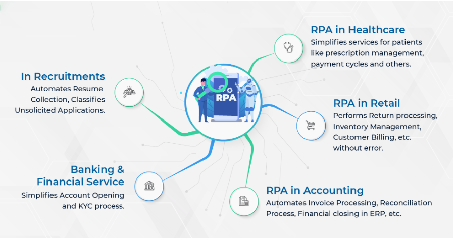
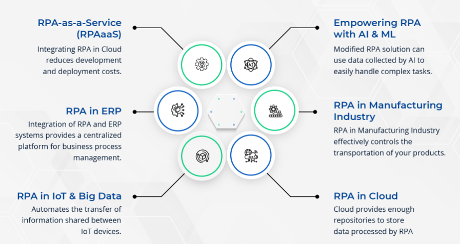

Dijital dönüşüm yarışında, robotik süreç otomasyonu (RPA), genellikle önemli iş süreçlerini optimize etmenin ve eski sistemlerin ömrünü uzatmanın hızlı ve etkili bir yolu olarak lanse ediliyor. Proses otomasyon robotları, tekrarlayan işler yapma konusunda insanlarla aynı yeteneklere sahiptir. Dosyaları taşımak, e-postaları taramak, programlarda oturum açmak, API'lere bağlanmak, verileri çıkarmak ve diğerleri RPA ile otomatikleştirilebilir. 

<!--truncate-->

RPA, maliyet azaltma, daha fazla doğruluk, sonuçların daha hızlı teslimi gibi kanıtlanmış ticari avantajlara sahiptir. Bu, daha yüksek müşteri memnuniyeti ile sonuçlanmıştır çünkü tekrarlayan görevler insanlar tarafından yapıldığında hatalara eğilimlidir. Daha fazla çalışan bağlılığı ve gelir fırsatı getiren süreç iyileştirme, araştırma ve diğer problem çözme yöntemlerinde daha iyi sonuçlar elde ettiler.

BT liderlerinin, RPA'yı getirmesi için stratejiler hizalama, büyük yazılımları desteklemek için uygun yönetişim, süreç istikrarı, kültürel ve organizasyonel değişiklikler, ekip üyeleri arasında şeffaf vizyon ve çok uygun metrikler içeren daha geniş planlara ihtiyacı var.

### **Yeni Trendleri Tetikleyen RPA Örnekleri**

Başlangıçta, RPA ortaya çıktığında asıl endişe, insanların yerini almaya başlamasıydı. RPA, daha fazla işletmeyi ve BT sürecini basit bir şekilde otomatikleştirmenize, dijital dönüşüm elde etmelerine ve başarı öyküleri oluşturmalarına yardımcı olabilir. Birçoğu için, RPA sağlayıcılarıyla ortaklık, daha fazla üretkenlik ve başarıyı artırdı.

RPA hizmet pazarı, son 2 ila 3 yılda muazzam bir büyüme kaydetti. Grand View Research'e göre, küresel RPA otomasyon pazar büyüklüğü 2019'da 1,40 milyar dolar olarak belirlendi ve 2027 yılına kadar 11 milyar dolara ulaşması bekleniyor. Şu anda birkaç kullanım durumu var.

>- Bankacılık ve Finansal Hizmet: Bankalar, hizmetlerin veya RPA'nın otomasyonunu benimsedi ve KYC araması, rapor oluşturma, bazı basit hesaplamalar vb. gibi çok sayıda tekrarlayan ve kural tabanlı görev otomatikleştirildi. Akıllı hesap, açma çözümleri ve KYC aracılığıyla süreç otomasyonu; mükemmel müşteri deneyimi ve operasyonel verimlilik elde edilir. Sigorta şirketleri de otomasyonda diğer işletmelerin gerisinde olsalar da çeşitli şekillerde otomasyonu benimsediler. Politika yönetimi, mevzuata uygunluk gibi bazı görevler RPA tarafından yapılır.
>
>- Sağlık Hizmetinde RPA: Sağlık hizmetleri, hastaların sağlığı ile doğrudan bağlantılı olduğu için RPA'yı kendi iç süreçlerinde özümsemiştir. Çoğu büyük hastane, hata oranını azaltan ve müşteri deneyimini geliştiren politika yönetimi, reçete yönetimi, ödeme döngüsü için otomatik süreçlere sahiptir.
>
>- Perakendede RPA: Perakende sektörü müşteri odaklı bir sektördür, bu nedenle RPA gibi yenilikçi teknoloji çözümleri müşteri deneyimini iyileştirmeye yardımcı olur. İade işlemlerinde stok yönetimi, müşteri faturalandırma ve geri ödeme işlemleri RPA yardımıyla hatasız ve gecikmeden yapılabilmekte, ayrıca müşteri destek yönetimi daha hızlı hale gelmektedir.
>
>- Muhasebede RPA: Finans ve muhasebede RPA, bir sürecin bir parçası ile sınırlı değildir, aynı anda birden fazla sürece, yani fatura işleme, borç hesapları, alacak hesapları, mutabakat süreci, ERP'deki finansal kapanışa uygulanabilir. 
>
>- İşe Alımlarda: RPA sistemi, çeşitli platformlardan özgeçmişler alabilir, değere erişebilir, spam veya istenmeyen uygulamaları sınıflandırabilir ve diğer benzer faktörleri değerlendirebilir. Bu, işe alım görevlileri üzerindeki baskıyı azaltabilir ve onlara tüm adaylara ulaşmaları için daha fazla fırsat verebilir. RPA, seçim, değerlendirme, ölçüm, işe alım ve yönetim gibi önemli işe alım süreçlerinin %90 ila %95'ini yönetebilir.

 

### **2021'de 6 Robotik Proses Otomasyonu (RPA) Trendi**

RPA'nın benimsenmesi, giderek tüm sektörlerde verimliliği artırmanın temel taşı haline geliyor. Otomasyonun artan popülaritesi ve faydaları ile birlikte RPA endüstri trendleri hızla ortaya çıkıyor. Şirketler, yeni kullanım örnekleri aracılığıyla RPA araçlarını çalışır duruma getirmenin yenilikçi yollarını arıyor.

>
>- Bulutta RPA: Tıbbi RPA trendi, banka RPA trendi veya sigorta RPA trendi olsun, bulut artık bir zorunluluktur. RPA, büyük miktarda veriyi işler. Bulut dağıtımı, RPA'yı depolamak için yeterli havuza sahiptir. Bu, bir RPA altyapısı oluşturabileceğiniz ve robotları sanal olarak dağıtabileceğiniz anlamına gelir. Esasen, bulut bilişim aynı zamanda birden fazla işlevi yerine getirebilen otonom robotların kaynağı haline gelecek.
>
>- ERP'de RPA: RPA ve ERP sistemlerinin entegrasyonu, iş süreci yönetimi için merkezi bir platform sağlar. Tedarik zincirindeki ERP, satıcılarla ilgili kararları kesinleştirirken insan etkileşimini gerektirir. RPA, satın alma ve nakliye malzemeleri için tedarikçiler seçerek, tedarikçi belgelerini gözden geçirerek, kredi kontrolleri yaparak ve tedarikçi seçimini tamamlayarak tedarikçi seçimini ve tedarikini otomatikleştirebilir.
>
>- Hizmet olarak RPA (RPAaaS): Birçok otomasyon sistemi entegratörü, RPA'nın büyük popülaritesinden yararlanıyor ve bir hizmet olarak RPA (RPAaaS) modelini tanıtmayı planlıyor. Birçok SaaS kuruluşu, bulutta çeşitli çözümler geliştirerek ek bakım maliyetlerine maruz kalmadan çalışma şeklini değiştirdi; RPAAaS aynı faydaları sağlayacaktır. RPAAaS, geliştirme ve dağıtım maliyetlerini kademeli olarak azaltacak ve en etkili ve en yeniden kullanılabilir bileşenleri dağıtma ihtiyacını artıracaktır.
>
>- RPA'yı AI ve ML ile Güçlendirme: RPA, AI'ya entegre edildiğinde, otomasyon süreci daha hızlı işlemeye başlayabilir ve sürekli otomasyona ulaşabilir. AI ve RPA'nın yakınsaması, şirketlerin her zamankinden daha karmaşık uçtan uca süreçleri otomatikleştirmesine ve çalışanların daha akıllı ve daha hızlı çalışabilmesi için tahmine dayalı modelleri ve analitiği bu süreçlere entegre etmesine olanak tanır.
>

Bu teknolojilerin her ikisi de (RPA ve AI), akıllı otomasyon için daha sağlam bir platform oluşturmak üzere birlikte entegre edilebilir. Değiştirilmiş RPA çözümü, karmaşık görevleri kolayca yerine getirmek için yapay zeka tarafından toplanan verileri kullanabilir.

>- İmalat Sanayinde RPA: Her imalat sanayiinde, bitmiş ürünlerin müşterilere nakliyesini yöneten bir lojistik departmanı vardır. RPA ile entegre nakliye yönetim sistemi, ürünlerinizin nakliyesini etkin bir şekilde kontrol etmenizi sağlar.
>
>- IoT ve Büyük Veride RPA: Artan akıllı cihaz sayısı ile buluttaki veri miktarı da artıyor. IoT'de RPA, görevler ve veri süreçleri hakkında bilgi sağlamaya yardımcı olabilir. Bu bilgiler, çeşitli gizli gerçekleri ve verileri, iş fikirlerini ve eğilimleri ortaya çıkarmaya, iş operasyonlarındaki içgörüleri keşfetmeye yardımcı olur. 

### AI Etkin RPA, Kitle Otomasyonunun Geleceğidir

Son zamanlarda, RPA robotları ve akıllı mekanizasyon (AI) çözümleri, bu sorunu çözmede ve başarıya ulaşmada kritik öneme sahiptir. RPA, şirketler için yeni ufuklar açabilir ve mükemmel ve kişiselleştirilmiş müşteri hizmeti sunma konusunda yeni potansiyeller açabilir. Kuruluşlar, otomasyon nedeniyle sürekli arıza giderme döngüleri ve kesinti süreleri ile mücadele ettiğinden, RPA'nın faydaları sınırlı olabilir. 

İnovasyonun iş operasyonlarını iyileştirmenin bir ayağı haline gelmesiyle birlikte, RPA bir seçenek olmaktan çıkıp bir ihtiyaç haline geliyor. İşletmelerin müşteri deneyiminden yararlanmak için eğilimleri dikkatli bir şekilde analiz etmesi gerekir. RPA'nın uygulanması hala zor, bu nedenle küçük tekrarlayan görevlerin yerine RPA'yı başlatmak ve ardından ölçeklendirmek hala daha iyidir. İşletmeler RPA için teknik uzmanlığa ihtiyaç duyduğundan, RPA ortaklarıyla işbirliği yapmak iş otomasyonunuz için istenen sonuçları getirebilir. 

RPA'nın geleceği, akıllı teknolojilerle birlikte yapay zeka, gelişmiş veri analizi, blok zinciri, iş süreci otomasyonu, optik karakter tanıma (OCR) ve diğer gelecekteki teknolojilerin kullanımını içerecektir.