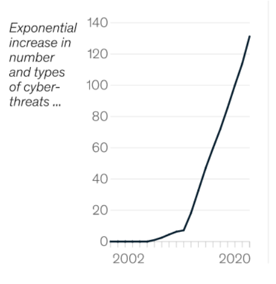

Business is based on trade offs. Digital solutions provide ease of doing business to corporations since they accelerate the flow of information. On the other hand, they provide new opportunities for criminals to steal value from businesses.

Knowing current cybersecurity trends can help businesses utilize the benefits of digital platforms while limiting cyber threats. This article discusses five major cybersecurity trends and their implications for businesses. 

<!--truncate-->

## 1. Cyberattacks are on the rise

The number of cyberattacks has exploded in the last decade (see Figure 1). This pattern appears to be continuing and will likely continue for some time. For example, Gartner predicts that in 2025, more than half of companies will check the cybersecurity posture of candidate business partners to make business with.

In comparison to 2020, the total number of cyberattacks climbed by 30% in 2021. When compared to the previous year, ransomware was the most common type of attack. Ransomware attacks surged by more than 100% in total.

Phishing assaults, according to Deloitte, are another form of cyber danger that harms businesses as much as ransomware. ENISA, on the other hand, warned about the potential of brute force assaults due to the new algorithms and models used by criminals.

Despite the fact that we are only a few months into 2022, the cyber risk landscape does not appear to be bright. Following Russia’s invasion of Ukraine, Fitch Ratings gave a notice to businesses about the increased cyber threats.  

## 2. Building a fortress is not a cybersecurity solution anymore

Until a few years ago, IT professionals structured an organization’s cybersecurity model as a fortress, in which everything within the office networks was assumed to be fundamentally trustworthy. To shield business infrastructure from the outside world, they build/buy hardware-based cloaking and web filtering solutions like VPNs and on-premise firewalls.

When employees operate in an office environment with secure Wi-Fi, laptops, and on-premise platforms, such a cybersecurity plan works well. However, after the Covid-19 pandemic people started to work from anywhere with any devices and corporations migrated to the public cloud platforms as an outcome of hybrid/remote working. As a result, ensuring Wi-Fi, laptop, or network security is no longer viable.

New-normal of working dictates that users, gadgets and networks should not be trusted inherently and always verified before providing access to any document or tool. Furthermore, because users and gadgets may be dangerous, staff should have access to as little data as possible. This new cybersecurity paradigm is called zero trust architecture.     

According to Microsoft’s study, 35% of companies fully adopted zero trust cybersecurity architecture and another 42% started implementing zero-trust architecture in 2021. Significant transformation is apparent on VPNs where around 60% of companies switched them with zero trust mentality implemented software defined perimeters (SDP).  

According to AIMultiple, the following cybersecurity solutions will be popular in 2022 and beyond due to their ability to secure businesses with hybrid/remote workers and public cloud platforms:

- Secure web gateway (SWG): A web security tool that ensures least access principle thanks to URL filtering capabilities 
- SDP: A zero trust driven web cloaking tool that allows micro segmentation. Thus, recently preferred over VPNs. 
- Zero trust network access (ZTNA): Ensures safe remote login to firms’ data and tools.
- Secure access service edge (SASE): Cobines networking and security tools such as firewalls, ZTNA and SWGs.

## 3. Digital supply chains are on the risk

In today’s world, supply chains are monitored and coordinated via supply chain software and telematics (Internet of Things devices). Therefore, an attack on supply chain tools or gadgets might entirely disrupt operations.

The hacking of SolarWind in 2020 demonstrated how a strike on an supply chain IT infrastructure company might disrupt the movement of commodities. According to Gartner, cyberattacks on supply chain infrastructure and software will increase in the coming years, with nearly half of all organizations being impacted by such assaults by 2025.  

As global political tensions rise, digital supply chain attacks may become more common as a means of causing damage to infrastructure and the well-being of opponents. The 2020 SolarWind hacking case, for example, is being blamed on Russians by US authorities. 

## 4. AI models improve both cyber risks and security
Improvements in AI capabilities introduce better defense capabilities for firms against cyberattacks. According to Capgemini more than 70% of organizations use AI models at least to some degree to cope with cyber risks. 

AI models are effective in:

- Detection: AI/ML models are taught to detect abnormalities in regular patterns which might indicate cyberattacks.
- Prediction: AI models are used to forecast the emergence of different types of cyberattacks.
- Response: When a cyberattack occurs, AI models automate the response that should be taken. They can, for example, remove patient zero from the network to prevent infection.

Professional hackers have enhanced tools for research and development of malicious software, including AI models. Hacking is now a multi-billion dollar industry so they have capital. Criminals can quickly adapt their attack methods thanks to AI models. In 2020, AI capabilities were used to improve the finance sector targeting the malicious code Emotet. 

## 5. State actors are significantly involved in cybersecurity issues

Cybersecurity is a national security issue. Digital platforms are used by the supply chain, the finance sector, and government entities. As a result, state actors intervene in cybersecurity to improve national cybersecurity postures. They also encourage or orchestrate cyberattacks on their opponents’ infrastructure to harm it.

On the bright side, cyber-related regulations and control mechanisms have been improved. Biden’s Executive Order on Cybersecurity, for example, requires federal agencies to improve their cybersecurity posture. The Executive Order also affects commercial enterprises that cooperate with federal agencies. Forbes views Biden’s choice as a blueprint for a safer internet for everyone, emphasizing the importance of cybersecurity and techniques like the zero-trust cybersecurity paradigm.

In addition there are some upgrades at cyberattack reporting. On March 10th, the US House and Senate passed legislation requiring companies in the financial, transportation, and energy sectors to notify any cyberattack to the government within three days. If a company makes the payment for a ransomware assault, the government must be notified within 24 hours. Senator Rob Portman, has expressed the rationale behind the decision with his concerns about a possible increase in Russian-based cyber attacks on US companies.

Senator’s concern highlights the darker side of government involvement in cybersecurity. According to ENISA, state-related entities was active cyber threats in 2021. 2022 can be even worse. For example, before the invasion of Ukraine, Russian intelligence services launched a series of cyberattacks to weaken Ukraine’s infrastructure. Political tensions and war-related cyberattacks, according to the Guardian, will continue to escalate.        

You can check our sortable/filtrable cybersecurity software, cybersecurity companies and secure web gateway vendors lists to improve your cybersecurity posture.