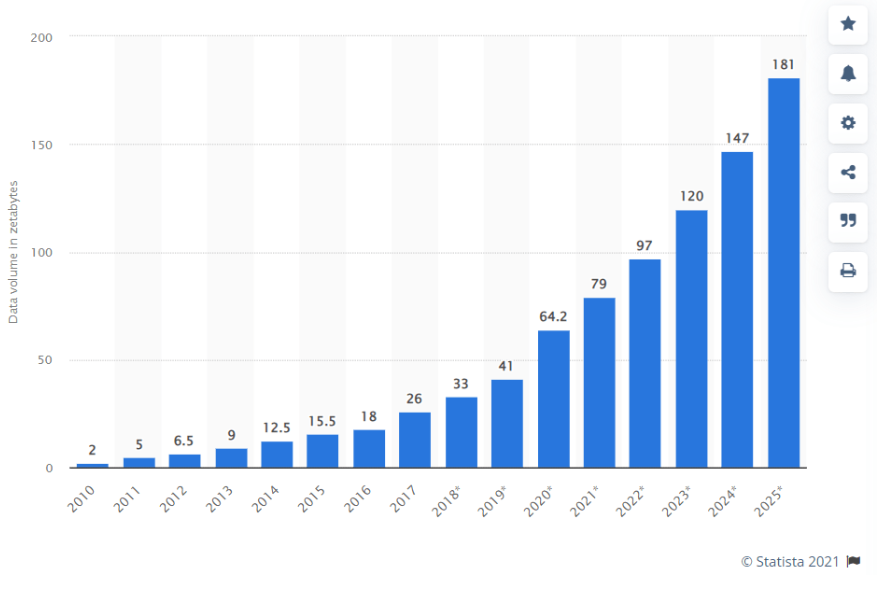
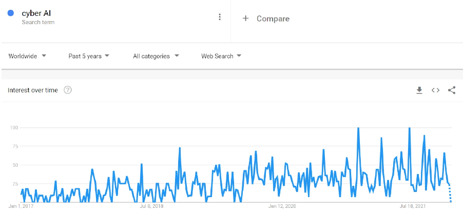
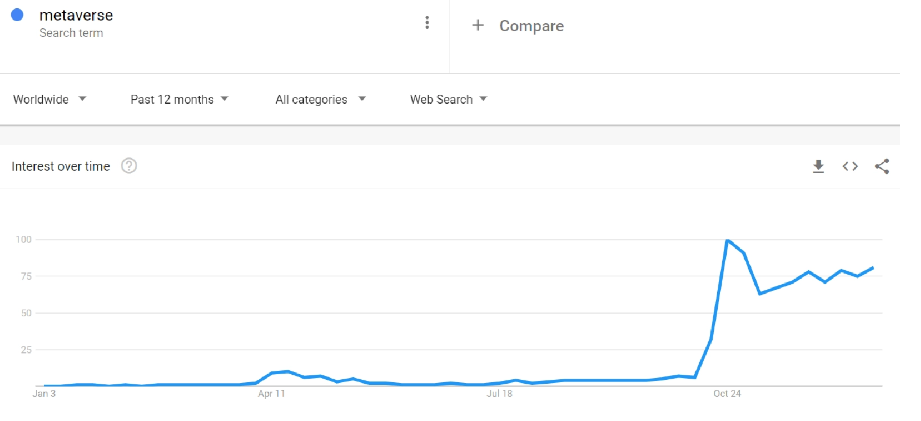

Teknoloji trendlerini ve aksaklıkları tahmin etmek zor bir iştir, ancak iş liderleri ve paydaşlar için süreçlerini iyileştirmek, müşteri memnuniyetini artırmak ve iş stratejilerini optimize etmek için büyük önem taşımaktadır.

Bu makalede, 2022'deki temel teknoloji trendlerini keşfediyor ve kendi araştırmamızın yanı sıra saygın anketler ve raporlara dayalı içgörüler ve tahminler sunuyoruz.

<!--truncate-->

## 1. Virtual event platforms
The shift to hybrid and remote work has significantly increased business reliance on virtual event platforms to organize meetings, training sessions, and business get-togethers. While some businesses are going back to the office, expectations are that businesses will continue organizing virtual events. A recent survey has revealed that:

Organizatörlerin %90'ı, tüm büyük ölçekli etkinliklerin 2023 yılına kadar hibrit veya sanal olacağına inanıyor.
Salgının ortaya çıkmasından sonra sanal etkinliklere katılanların sayısı %93 arttı.
İş katılımcılarının %93'ü, şirketlerin yüz yüze iletişimden çevrimiçi ortama geçişle iyi bir iş çıkardığını düşünüyor.
Recommendation
Aşağıdakiler gibi sanal etkinliklerin en iyi uygulamalarından yararlanarak sanal etkinlikler sırasında kitlenizin ilgisini canlı tutun:

- Reduce length of presentation
- Add videos to your presentation
- Host multiple speakers
- Interact with audience via polls, buttons, and Q&A sessions

## 2. Intelligent automation

Intelligent automation, also known as cognitive automation, is the practice of integrating AI and machine learning capabilities with automation technologies such as RPA. To date, ~90% of C-level executives report that some level of intelligent automation already exists within their organizations, and Deloitte has reported that intelligent automation has already exceeded executives’ expectations for success by 16-26%.

### Recommendation

With growing developments in AI and deep learning capabilities, you can start leveraging intelligent automation to:

Automate edge cases that are difficult to automate with non-cognitive RPA, such as processing trade finance transactions or insurance claims.
Incorporate automation with high level cybersecurity measures, such as running cyber threat hunts.
Leverage automation for customer-facing tasks, such as live coaching of sales reps, and resolving customer issues.

## 3. Data privacy enhancing technologies

As seen in figure [1] there is an exponential growth in data volume, and with more data comes more opportunity for businesses to gain insights, improve services, and monetize datasets. On the other hand, a 2021 Deloitte report points that more organizations are expected to engage in “data sharing” in order to tackle common challenges. This, in turn, is increasing business interest in data privacy-enhancing technologies to protect their clients’ and employees’ information and to comply with privacy regulations.

### Recommendation
Preserve data privacy while enabling collaboration by leveraging:

- Fully homomorphic encryption
- Differential privacy
- Functional encryption
- Federated analysis
- Zero knowledge proofs
- Secure multiparty computation

## 4. Blockchain for business

2021 has seen a rise in interest in different blockchain applications including DeFi, NFTs, and DApps. As for businesses, blockchain applications are spreading across different industries looking for reducing costs, detecting fraud, and increasing customer satisfaction, and according to IDC, spending on blockchain solutions by businesses is expected to reach ~$12B in 2022.

### Recommendation

Embrace blockchain technology in:

- IoT: Leveraging blockchain to store IoT data provides an additional layer of security to mitigate data breaches and prevent attackers from gaining access to the network.
Supply chain: Supply chain leaders can benefit from smart contracts to eliminate fraud, detect item location, and automate payment processes.

- Insurance: Insurance businesses can benefit from the anonymity provided by blockchain to improve their underwriting and risk assessment processes.

- Banking: Private and government banks have launched several digital currency projects based on blockchain technology in 2021, such as China’s digital Yuan. In 2022, Japan, Brazil, and England are expected to launch central bank digital currency (CBDC) pilots.

## 5. Cyber AI

Figure [2] shows that the past five years have seen increasing interest in leveraging AI and machine learning in cybersecurity, and it’s been estimated that the market of AI in cybersecurity will reach ~$46B by 2027. This is because the cost of cyber-attacks and data breaches is increasing and organizations are struggling to secure their data while shifting to remote work.

Forbes predicts that in 2022 AI will contribute to making cybersecurity responses smarter by:

- Detecting network vulnerability and threats
- Diagnosing incidents and respond accordingly
- Generating continuous cyber threat intelligence (CTI) reports

### Recommendation

Leverage AI to mitigating cyber attacks by:

- Monitoring emails for suspicious keywords and links.
- Detecting malware threats
- Reducing alert fatigue
- Identification of zero-day exploits

## 6. Synthetic data

Synthetic data, or data created by AI algorithms instead of real events, has been increasing in popularity among industries struggling with data availability due to solution novelty or data privacy regulations. We expect that the rising number of data privacy and AI ethics regulations will increase business dependence on synthetic data, and according to Gartner, by 2025, synthetic data will reduce personal customer data collection, avoiding 70% of privacy violation sanctions.

### Recommendation

Leverage synthetic data to:

- Generate simulations of edge cases and scenarios with limited data
- Improve the accuracy of supervised machine learning models
- Enable reproducibility of medical research
- Test autonomous things (e.g. robots, self-driving cars)

## 7. Metaverse for business

A metaverse, also known as Web 3, is an online virtual representation of the physical world where users can communicate and interact with each other using augmented reality (AR) and virtual reality (VR) hardware and software. In turn, businesses are viewing the metaverse as an opportunity to socialize and engage with their customers on novel platforms in 2022. For example:

- **Gucci** are already selling luxury products (e.g. perfumes, bags, sunglasses) as NFTs.

- **Nike** is planning to sell virtual sneakers in 2022.

- **Microsoft** are rolling out Mesh for Microsoft Teams in 2022 for business designs, trainings, meetings, and collaborations.

### Recommendation

Leverage the metaverse and its generated data in 2022 to:

- Place business ads on virtual platforms.
- Personalize content to users based on behavior data
- Directly communicate with customers
- Create a virtual office space for employees
- Generate digital twins of products or of the entire organization (DTO)

These are a few predictions for tech trends in 2022 based on our research. Feel free to offer us your insights in the comments section.