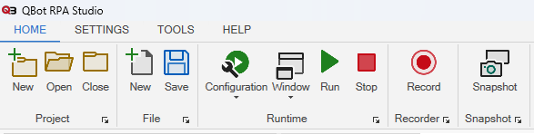

QBot Rpa Studio is written in C# language. It uses the .NET workflow structure. It allows you to easily design and automate your processes. QBot RPA Studio has its own filing system. The .qb file contains the configuration settings. These settings store information of project ID, project name, project directory, who created the project, who made the last change to the project, dates of creation and modification, project description, configuration setting, and startup project. Automations consist of .xaml files. 

QBot RPA Studio consists of 5 main builds. Toolbox, Workflow, Output, Solution Explorer, Properties. 

**Toolbox** : It contains all the workflow nodes. Nodes are divided into categories. All nodes are categorized and explained in the document.

**Workflow** : The area where we design the workflows.

**Output** : Shows detailed logs of running workflow.

**Solution Explorer** : Shows the file structure of the project.

**Properties** : Allows us to set the properties of the selected node added to the workflow. **In addition, the parameters of all nodes can be adjusted in the workflow.**

One of the most important features of Qbot RPA Studio is the recording feature. With Recording, you can create by repeating your processes and filling them in the automation basket. You can create automation by cleaning the nodes you do not want in the basket. Leave the job to QBot RPA Studio!

In addition, QBot has RPA Studio Show/Hide feature. You can have QBot RPA Studio hide or stay open while you test the automation after creating it.

There are debug and release modes in QBot RPA Studio. Debug mode shows logs of all running nodes. Release mode shows only the areas that you have specific logging. **For example, put QBot RPA Studio in release mode. Add a node to your workflow. Then add the WriteLine node and fill it in. Run QBot RPA Studio. You will only see the value you typed in WriteLine.**

QBot RPA Studio sends you the results of the nodes working. All nodes that do not return a result return a result parameter. This parameter returns a boolean value. Thus, results returning true can be viewed as successful and results returning false as unsuccessful.

In QBot RPA Studio menu, create a new project, open an existing project, close the project, create a new xaml file, save the xaml file, set the configuration (debug/release) mode, set the window (show/hide) mode, automation start/stop, It has recording and capturing features.

