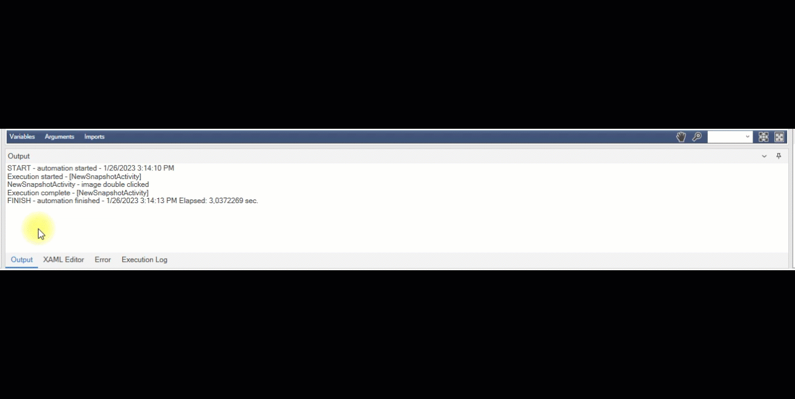

# Output

Output shows us the logs in detail. In the **Output** tab, it displays the running time, start/end time, detailed logs of the running nodes of the running workflow. In the **XAML editor** tab we can view the xaml file content of our workflow. We can see the error logs of our workflow running in the **Error** tab, as well as in the output tab, in detail here. In the **Execution Log** tab, we can see detailed logs of the start, execution, and end times of all running nodes.

