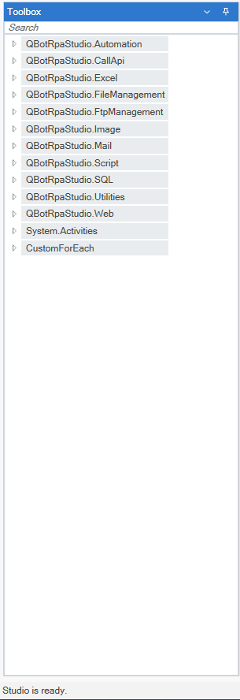

# Toolbox

All nodes are stored in the Toolbox to create the workflow. It is presented to us in categories as seen below. Except for QBot RPA Studio special nodes, system activities are also added as nodes.

