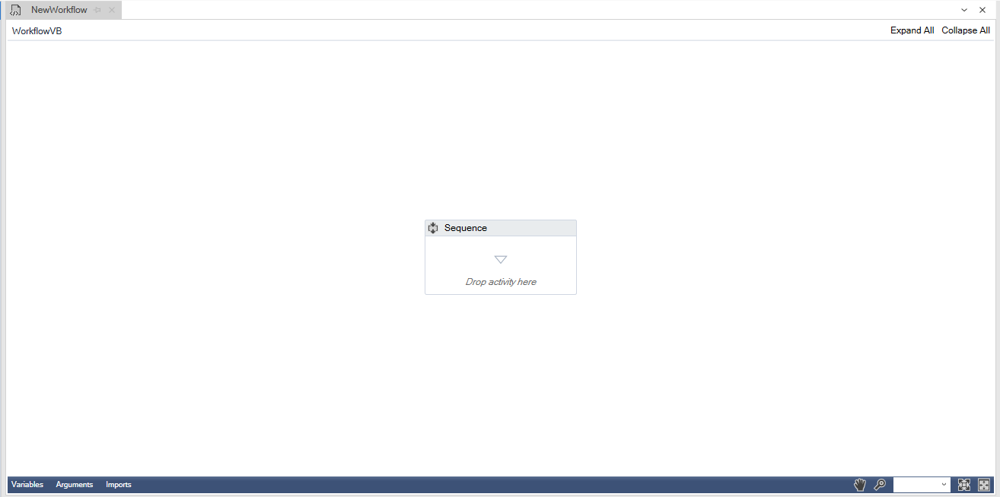
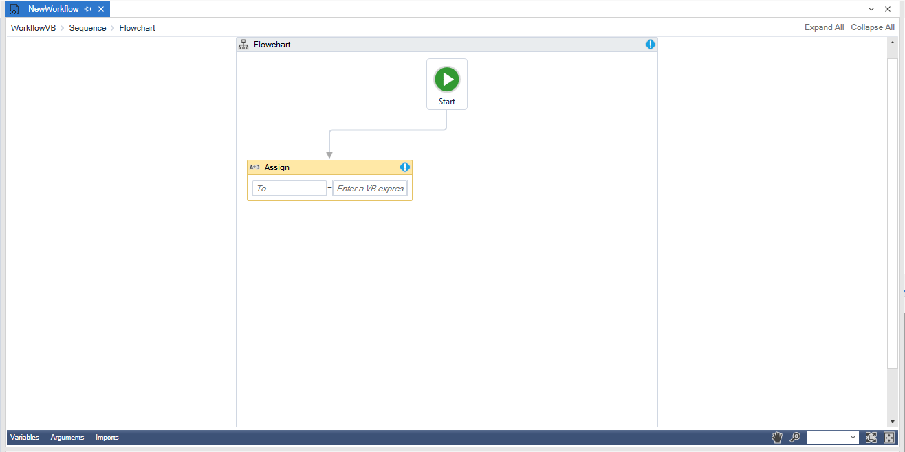
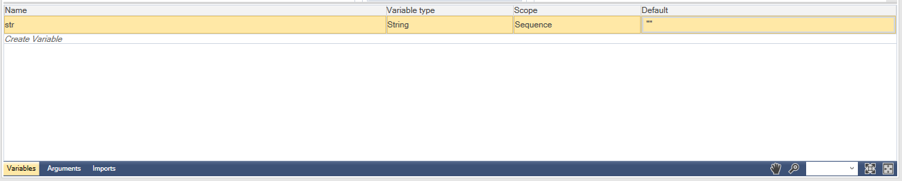
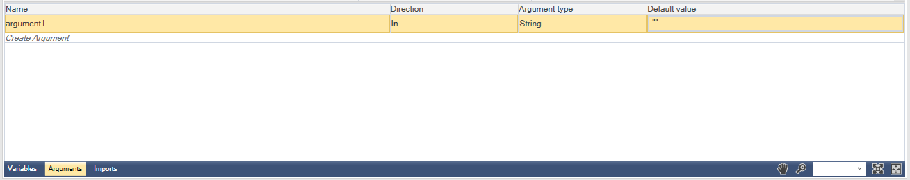
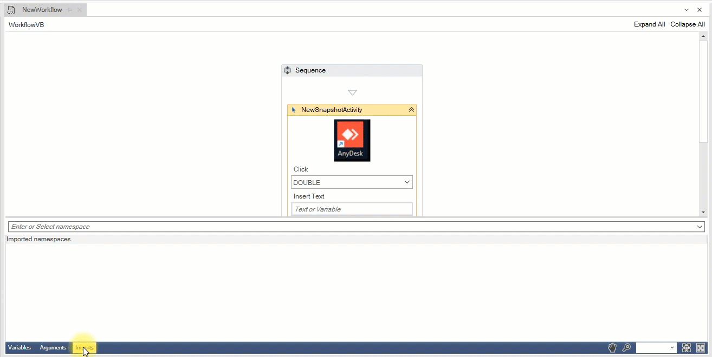

# Workflow

Workflow is where we design workflows. Workflow works with two different structures. The sequence structure designs the flow by listing the nodes one after the other as seen below.

Flow structure, on the other hand, designs flow by connecting nodes. The flow structure, on the other hand, designs the flow by connecting the nodes. You can do this with the Flowchart node.

We can specify the variables from the tab at the bottom of the workflow. We can choose all types as variable type. For example, by importing Newtonsoft.Json library, a variable can be created with JArray type.

We can use it to send arguments within the project. In the same way as In, Out, Property, we can create any type of argument we want.

You can use the following method to import libraries from outside within the project. Contains all libraries in Nuget Packages.

