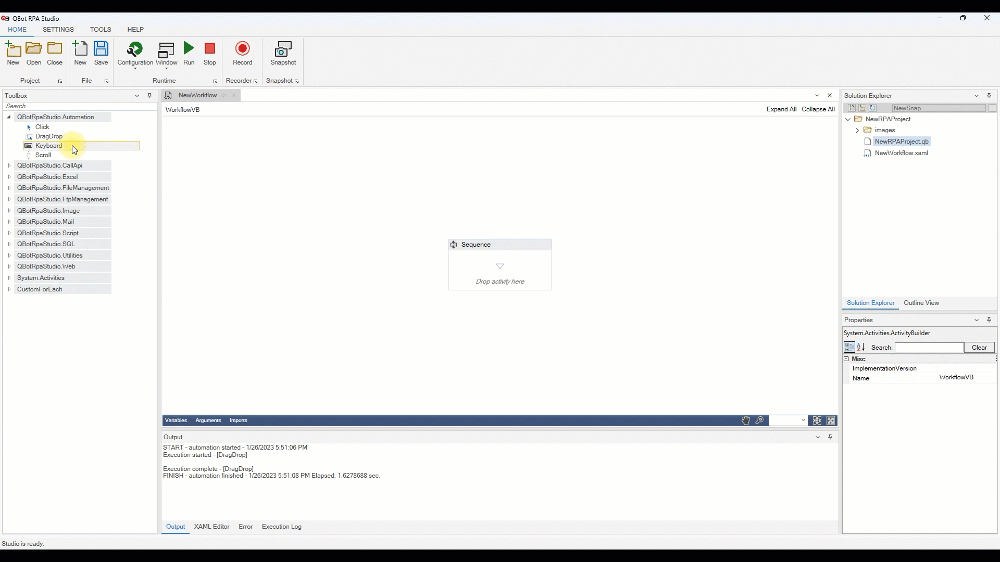

# Keyboard

>The keyboard automates all keyboard functions. There are ready-made keypads inside the keyboard. We can create custom text or use hotkeys. Example usage is below.

>># Example

>>>**Keyboard shortcut** : ctrl+a -> Add Key 

